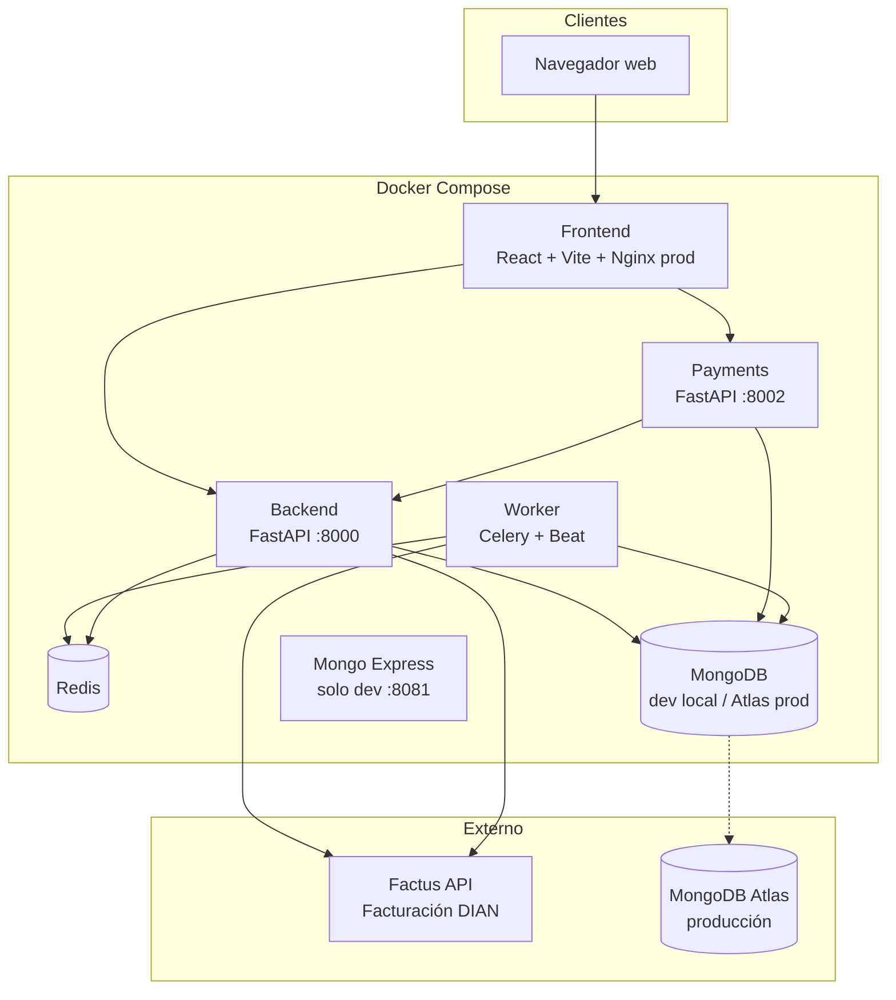
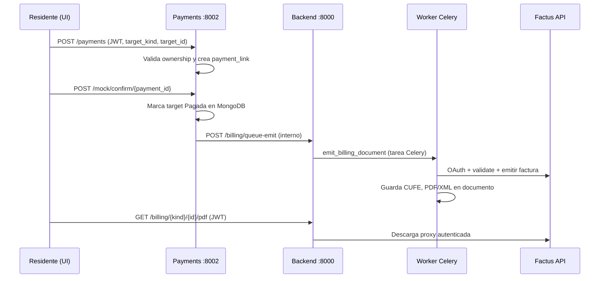

# Residencial — Tu hogar, en orden

Documentación completa del proyecto de gestión de conjuntos residenciales en Colombia: cobros de administración, reservas de amenidades, gimnasio, pagos en línea y facturación electrónica ante la DIAN vía **Factus API**.

| Campo | Valor |
|-------|--------|
| **Nombre comercial** | Residencial |
| **Eslogan** | Tu hogar, en orden |
| **Carpeta del repo** | `cobros-residenciales/` |
| **Base de datos** | `cobros_residenciales` (MongoDB) |
| **País / normativa** | Colombia — facturación electrónica DIAN |

---

## Tabla de contenidos

1. [Visión general](#1-visión-general)
2. [Arquitectura del sistema](#2-arquitectura-del-sistema)
3. [Stack tecnológico](#3-stack-tecnológico)
4. [Microservicios](#4-microservicios)
5. [Modelo de datos (MongoDB)](#5-modelo-de-datos-mongodb)
6. [Lógica de negocio](#6-lógica-de-negocio)
7. [Facturación electrónica DIAN (Factus)](#7-facturación-electrónica-dian-factus)
8. [Pagos](#8-pagos)
9. [Reservas y calendario](#9-reservas-y-calendario)
10. [Gimnasio](#10-gimnasio)
11. [Worker y automatizaciones](#11-worker-y-automatizaciones)
12. [Frontend](#12-frontend)
13. [API REST — referencia de endpoints](#13-api-rest--referencia-de-endpoints)
14. [Seguridad](#14-seguridad)
15. [Variables de entorno](#15-variables-de-entorno)
16. [Ejecución local](#16-ejecución-local)
17. [Despliegue](#17-despliegue)
18. [Pruebas automáticas](#18-pruebas-automáticas)
19. [Estructura de carpetas](#19-estructura-de-carpetas)
20. [Documentos relacionados](#20-documentos-relacionados)

---

## 1. Visión general

**Residencial** es un portal web para administrar la vida de un conjunto residencial:

- **Cobros de administración** mensuales por unidad, proporcionales al **coeficiente de copropiedad**.
- **Reservas** de parqueadero de visitantes (por hora) y salón comunal (por día).
- **Suscripción mensual del gimnasio**, con renovación automática si el residente pagó el mes anterior.
- **Pagos en línea** mediante un microservicio dedicado (`payments`), con proveedor mock en desarrollo.
- **Facturación electrónica** para administración, reservas y gimnasio, integrada con **Factus** (proveedor habilitado ante la DIAN).

Hay dos roles:

| Rol | Capacidades |
|-----|-------------|
| **Admin** | Usuarios, unidades, facturas, amenidades, reservas, gimnasio, reportes, reintentos Factus |
| **Residente** | Sus facturas, reservas, gimnasio, perfil fiscal, pagos de lo propio |

---

## 2. Arquitectura del sistema

Arquitectura de **microservicios** orquestados con **Docker Compose**. En desarrollo incluye MongoDB local; en producción usa **MongoDB Atlas** y solo Redis en el servidor.



### Puertos (desarrollo)

| Servicio | URL |
|----------|-----|
| Frontend | http://localhost:5174 |
| Backend (Swagger) | http://localhost:8000/docs |
| Payments (Swagger) | http://localhost:8002/docs |
| Mongo Express | http://localhost:8081 |
| MongoDB | localhost:27017 |
| Redis | localhost:6379 |

> En Docker dev el host expone **5174** mapeado al **5173** interno de Vite, para evitar conflictos con otros proyectos en 5173.

### Flujo de pago y facturación



---

## 3. Stack tecnológico

### Frontend

| Tecnología | Versión / uso |
|------------|----------------|
| **React** | 18.3 — UI |
| **TypeScript** | 5.6 |
| **Vite** | 5.4 — bundler y dev server (HMR) |
| **Tailwind CSS** | 3.4 — estilos utility + tokens `app-*` |
| **React Router** | 6.26 — rutas (`/login`, dashboards) |
| **Axios** | 1.7 — cliente HTTP con JWT |
| **Nginx** | Producción (`Dockerfile.prod`) sirve `dist/` |

### Backend

| Tecnología | Uso |
|------------|-----|
| **Python** | 3.12 (imágenes Docker slim) |
| **FastAPI** | 0.115 — API REST |
| **Uvicorn** | ASGI server |
| **Motor / PyMongo** | MongoDB async/sync |
| **Pydantic v2** | Modelos y validación |
| **python-jose** | JWT |
| **passlib + bcrypt** | Hash de contraseñas |
| **httpx** | Cliente HTTP (Factus, proxies) |
| **structlog** | Logging estructurado |
| **Celery + Redis** | Encolar tareas desde backend (`emit_billing_document`) |

### Worker

| Tecnología | Uso |
|------------|-----|
| **Celery 5.4** | Tareas asíncronas + **Celery Beat** (cron) |
| **Redis** | Broker y backend de resultados |
| **httpx** | Factus, health-checks |

### Payments

| Tecnología | Uso |
|------------|-----|
| **FastAPI** | API de pagos y webhooks |
| **PyMongo** | Misma BD que backend |
| **python-jose** | Validar JWT del usuario |

### Infraestructura

| Componente | Imagen / versión |
|------------|------------------|
| **MongoDB** | `mongo:7` (solo dev compose) |
| **Redis** | `redis:7-alpine` |
| **Mongo Express** | `mongo-express:1.0.2` (solo dev) |
| **Docker Compose** | `docker-compose.yml` (dev), `docker-compose.prod.yml` (prod) |

---

## 4. Microservicios

### 4.1 Frontend (`frontend/`)

SPA React. En desarrollo corre con Vite y **bind mount** del código para hot reload en Windows (`CHOKIDAR_USEPOLLING=true`). En producción se construye estático y se sirve con Nginx en el puerto 80.

Variables inyectadas en build: `VITE_BACKEND_URL`, `VITE_PAYMENTS_URL`.

### 4.2 Backend (`backend/`)

API principal: autenticación, CRUD, facturas, reservas, gimnasio, reportes, proxy de descargas Factus, encolado de emisión.

Punto de entrada: `backend/app/main.py`.

### 4.3 Payments (`payments/`)

Microservicio **desacoplado** de facturas: acepta cualquier `target_kind`:

- `invoice` — cuota de administración
- `reservation` — reserva de amenidad
- `gym_subscription` — mensualidad gimnasio

Compatibilidad: el campo legacy `invoice_id` se normaliza a `target_kind=invoice`.

### 4.4 Worker (`worker/`)

Proceso Celery con **`--beat`** en el mismo contenedor (`worker/Dockerfile`). Ejecuta generación mensual, morosidad, cancelación de reservas, reintentos Factus, reconciliación mock, métricas y health checks.

Cliente Factus: `worker/app/factus_client.py`.

---

## 5. Modelo de datos (MongoDB)

Base de datos: **`cobros_residenciales`** (configurable con `MONGODB_DB`).

### Colecciones principales

| Colección | Descripción |
|-----------|-------------|
| `users` | Admin y residentes; `tax_profile` para Factus |
| `units` | Apartamentos (`code`, `coefficient`, `resident_user_id`) |
| `invoices` | Cuotas mensuales por unidad y periodo `YYYY-MM` |
| `payments` | Intentos de pago (`target_kind`, `target_id`, `status`) |
| `amenities` | Parqueaderos visitante / salones (`type`, `code`, `active`) |
| `reservations` | Reservas con `start_at`, `end_at`, `amount_cop`, `access_pin` |
| `gym_subscriptions` | Suscripción por `(user_id, period)` |
| `metrics` | Métricas precalculadas para dashboards |
| `automation_runs` | Traza de cada tarea Celery |
| `system_health_checks` | Resultado de health check cada 5 min |

### Identificadores idempotentes

| Entidad | Patrón `_id` |
|---------|----------------|
| Factura | `inv_{YYYY-MM}_{unit_id}` |
| Reserva | Generado con `new_id()`; solapamiento validado por amenidad + rango |
| Gym | Idempotente por usuario + periodo |

### Estados

| Entidad | Estados |
|---------|---------|
| Factura | `Pendiente` → `Pagada` o `Vencida` |
| Reserva | `Pendiente` → `Pagada` o `Cancelada` |
| Gimnasio | `Pendiente` → `Pagada` |
| Pago | `created` → `confirmed` / `failed` |

### Enums (`backend/app/domain/enums.py`)

- `UserRole`: `admin`, `resident`
- `AmenityType`: `visitor_parking`, `social_hall`
- `PaymentTargetKind`: `invoice`, `reservation`, `gym_subscription`

---

## 6. Lógica de negocio

### 6.1 Cuota de administración

```
monto_cop = round(ADMIN_FEE_BASE_COP × coeficiente_unidad)
```

- **`ADMIN_FEE_BASE_COP`**: default `300000` COP.
- **Periodo**: `YYYY-MM` (mes calendario UTC).
- **Vencimiento**: día `INVOICE_DUE_DAY` (default `10`), clampeado entre 1 y 28, hora `23:59:59 UTC`.
- Implementación: `backend/app/utils/billing.py`.

### 6.2 Morosidad

Al listar facturas o al consultar `/reports/dashboard`, las facturas `Pendiente` con `due_date < now` pasan a **`Vencida`**.

El worker también ejecuta `mark_overdue_invoices` diariamente a las 06:00 UTC.

### 6.3 Tarifas de servicios

| Variable | Default | Unidad |
|----------|---------|--------|
| `VISITOR_PARKING_HOURLY_COP` | 2000 | COP / hora |
| `SOCIAL_HALL_DAILY_COP` | 150000 | COP / día |
| `GYM_MONTHLY_COP` | 40000 | COP / mes |

### 6.4 Visibilidad residente

El residente **no posee** facturas directamente: las ve si su `user_id` está en `units.resident_user_id` de la unidad facturada.

### 6.5 Reservas

- Validación de **solapamiento** en backend al crear reserva.
- Parqueadero de visitantes: genera **`access_pin`** para portería cuando está pagada.
- Reservas `Pendiente` sin pago se **cancelan** tras `RESERVATION_PENDING_EXPIRE_MINUTES` (default 30).

### 6.6 Gimnasio

- Suscripción idempotente por `(user_id, period)`.
- El día 1 de cada mes, si el residente pagó el mes anterior, el worker crea la suscripción `Pendiente` del mes actual.

---

## 7. Facturación electrónica DIAN (Factus)

Colombia exige facturación electrónica validada por la **DIAN**. Este proyecto integra **Factus** como proveedor tecnológico (API REST v1/v2).

### Configuración (`.env`)

```env
FACTUS_HOST=https://api-sandbox.factus.com.co
FACTUS_CLIENT_ID=
FACTUS_CLIENT_SECRET=
FACTUS_USERNAME=
FACTUS_PASSWORD=
FACTUS_NUMBERING_RANGE_ID=
```

Sin credenciales, el sistema funciona en modo **sin emisión electrónica** (solo cobros y estados locales).

### Qué se factura electrónicamente

| Tipo | Cuándo se emite |
|------|-----------------|
| **invoice** | Generación mensual (worker día 1) o tras pago |
| **reservation** | Tras confirmar pago (cola `emit_billing_document`) |
| **gym_subscription** | Tras confirmar pago |

### Perfil fiscal (`tax_profile`)

Cada residente debe tener datos fiscales completos en `users.tax_profile` (documento, municipio, tributo, etc.). Si falta, el worker guarda error `missing_tax_profile_for_factus` y **no reintenta** indefinidamente.

El admin puede editar `tax_profile` desde **Usuarios**. El residente lo completa en **Mi perfil**.

Catálogos auxiliares (solo admin):

- `GET /factus/municipalities`
- `GET /factus/measurement-units`

### Flujo técnico

1. **OAuth2** password grant → `POST {FACTUS_HOST}/oauth/token`
2. **Validar** servicio → `POST /v2/bills/validate` con ítem, cliente mapeado desde `tax_profile`
3. **Emitir** y guardar en MongoDB: `factus_number`, `factus_cufe`, `factus_public_url`, `pdf_url`, `xml_url`, `pdf_file_id`, `xml_file_id` (GridFS opcional)

### Descargas seguras

El frontend **no** enlaza URLs públicas de Factus directamente. Descarga vía backend con JWT:

- `GET /billing/{kind}/{doc_id}/pdf`
- `GET /billing/{kind}/{doc_id}/xml`
- Legacy facturas: `GET /invoices/{id}/pdf`, `GET /invoices/{id}/xml`

Reintento manual (admin o dueño del documento):

- `POST /billing/{kind}/{doc_id}/retry-factus`
- `POST /invoices/{invoice_id}/retry-factus`

### Reintentos automáticos

Tarea `retry_factus_errors` cada 6 horas, hasta `FACTUS_RETRY_LIMIT` documentos (default 25), excluyendo errores de perfil fiscal faltante.

---

## 8. Pagos

### Endpoints (`payments` :8002)

| Método | Ruta | Descripción |
|--------|------|-------------|
| GET | `/health` | Salud |
| POST | `/payments` | Crear intención de pago (requiere JWT) |
| GET | `/payments/{id}` | Consultar pago |
| POST | `/mock/confirm/{id}` | Confirmar pago mock |
| POST | `/demo/confirm/{id}` | Alias demo (solo `APP_ENV=dev`) |
| POST | `/webhooks/{provider}` | Webhook genérico (`approved`, `paid`, etc.) |

### Ownership

- **Residente**: solo paga facturas de sus unidades, sus reservas y su gimnasio.
- **Admin**: puede pagar cualquier target.

### Desarrollo

- `payment_link` apunta a `{origin}/mock-pay?payment_id=...`
- Worker `reconcile_mock_payments` (cada hora, solo dev) confirma pagos `created` antiguos tras `PAYMENT_RECONCILE_AFTER_MINUTES`.

---

## 9. Reservas y calendario

### Tipos de amenidad

| `type` | UI residente | Cobro |
|--------|----------------|-------|
| `visitor_parking` | Parqueadero | Por horas entre `start_at` y `end_at` |
| `social_hall` | Salón comunal | Por días |

### Calendario visual

Componente `ReservationCalendar.tsx` + API:

```
GET /reservations/calendar?from=&to=&type=visitor_parking|social_hall
```

- Celdas **verdes** = libre; **ocupadas** = otra reserva (admin ve nombre del residente).
- Clic en celda libre rellena el formulario de reserva.

Lógica detallada: ver **[README_LOGICA_CALENDARIO_Y_GIRA.md](./README_LOGICA_CALENDARIO_Y_GIRA.md)**.

### Endpoints reservas

| Método | Ruta | Rol |
|--------|------|-----|
| POST | `/reservations` | Residente / admin |
| GET | `/reservations` | Admin (filtros) |
| GET | `/reservations/my` | Residente |
| GET | `/reservations/calendar` | Autenticado |
| GET | `/reservations/{id}` | Autenticado |
| POST | `/reservations/{id}/cancel` | Dueño / admin |
| DELETE | `/reservations/{id}` | Admin |

### Amenidades

| Método | Ruta |
|--------|------|
| POST/GET/PATCH/DELETE | `/amenities` |
| GET | `/amenities/{id}/availability?from=&to=` |

---

## 10. Gimnasio

| Método | Ruta | Descripción |
|--------|------|-------------|
| POST | `/gym/subscriptions` | Crear suscripción del mes (idempotente) |
| GET | `/gym/subscriptions/my` | Mis suscripciones |
| GET | `/gym/subscriptions` | Admin — listado |
| GET | `/gym/subscriptions/{id}` | Detalle |
| DELETE | `/gym/subscriptions/{id}` | Admin — eliminar |

---

## 11. Worker y automatizaciones

Programación en `worker/app/celery_app.py` (timezone **UTC**):

| Tarea | Cron | Descripción |
|-------|------|-------------|
| `generate_monthly_invoices` | Día 1, 05:00 | Facturas del mes + Factus si configurado |
| `create_monthly_gym_subscriptions` | Día 1, 05:10 | Renovación gimnasio |
| `mark_overdue_invoices` | Diario 06:00 | Pendiente → Vencida |
| `cancel_stale_pending_reservations` | Cada 15 min | Libera amenidades no pagadas |
| `retry_factus_errors` | Cada 6 h (:20) | Reintento emisión Factus |
| `reconcile_mock_payments` | Cada hora (:35) | Solo `APP_ENV=dev` |
| `precompute_metrics` | Cada hora (:45) | Colección `metrics` |
| `health_check` | Cada 5 min | Mongo, backend, payments → `system_health_checks` |

Tareas bajo demanda (desde backend):

- `emit_billing_document(kind, doc_id)` — tras pago o reintento manual

Cada ejecución registra resumen en **`automation_runs`**.

---

## 12. Frontend

### Rutas

| Ruta | Componente |
|------|------------|
| `/login` | `LoginPage.tsx` |
| `/` (autenticado) | `AdminDashboard` o `ResidentDashboard` según rol |

### Branding

- Marca: **Residencial** — *Tu hogar, en orden*
- Login: panel oscuro + formulario claro, fondo animado `residential-bg.png`, chips Portería / Visitantes / Gimnasio / Salón / Parqueaderos
- Sidebar: logo casa, subtítulo "Cobros & Reservas"

### Funcionalidades destacadas (“plus”)

| Feature | Descripción |
|---------|-------------|
| **Tema claro / oscuro** | Toggle en topbar; CSS variables `app-*`; persistencia `localStorage`; respeta `prefers-color-scheme` |
| **Sidebar + SectionProvider** | Una sola fuente de verdad de sección activa (`useSection`) |
| **Responsive** | Sidebar fija en `lg+`; `<select>` de sección en móvil |
| **ConnectionStatus** | Pills de estado de APIs backend/payments |
| **ProfilePanel** | Perfil, unidades, documentos de facturación unificados, retry Factus |
| **ReservationCalendar** | Vista calendario interactiva para reservas |
| **ConsumptionBars** | Gráficas de consumo / métricas con colores por tema (`--chart-*`) |
| **Polling de pagos** | Tras iniciar pago, consulta estado hasta confirmación |
| **PIN de parqueadero** | Visible en reservas pagadas de visitantes |
| **Descarga PDF/XML** | Blob autenticado vía `apiErrors.ts` |
| **busyId por fila** | Solo el botón pulsado se deshabilita (UX admin) |
| **refresh selectivo** | No recarga todas las colecciones en cada acción |
| **prefers-reduced-motion** | Respeta accesibilidad en animaciones del login |
| **data-testid** | Atributos para E2E (`login-email`, `nav-facturas`, etc.) |

### Secciones admin

Perfil, Facturas, Usuarios, Unidades, Amenidades, Reservas, Gimnasio — más botón **Crear demo** (`POST /admin/seed-demo`).

### Secciones residente

Perfil, Mis facturas, Parqueadero, Salón comunal, Gimnasio.

### Librerías internas (`frontend/src/lib/`)

| Archivo | Rol |
|---------|-----|
| `api.ts` | Instancias Axios (backend, payments) |
| `auth.ts` | Token JWT en `localStorage` |
| `section.tsx` | `SectionProvider` / `useSection` |
| `theme.tsx` | `ThemeProvider` / `useTheme` |
| `billing.ts` | Tipos documentos unificados |
| `taxProfile.ts` | Formulario perfil fiscal Factus |
| `calendarUtils.ts` | Utilidades calendario |
| `invoiceUi.ts` | Helpers UI facturas |
| `apiErrors.ts` | Descarga blobs y errores API |

### Componentes

`Card`, `Button`, `ConnectionStatus`, `ProfilePanel`, `ReservationCalendar`, `ConsumptionBars`.

---

## 13. API REST — referencia de endpoints

Base URLs: Backend `http://localhost:8000`, Payments `http://localhost:8002`.

### Auth (`/auth`)

| Método | Ruta | Auth |
|--------|------|------|
| POST | `/register` | No — crear usuario (primer admin) |
| POST | `/login` | No — OAuth2 form (`username`, `password`) → JWT |
| GET | `/me` | JWT |

### Perfil (`/profile`)

| Método | Ruta |
|--------|------|
| GET | `` — usuario, unidades, facturas, `billing_documents`, flag `factus_configured` |
| PATCH | `` — actualizar nombre, email, `tax_profile` |
| POST | `/change-password` |

### Admin (`/admin`)

| Método | Ruta |
|--------|------|
| GET | `/users?role=` |
| POST | `/residents` |
| PATCH | `/users/{id}` |
| POST | `/users/{id}/reset-password` |
| DELETE | `/users/{id}` |
| POST | `/seed-demo` — solo `APP_ENV=dev` |

### Unidades (`/units`) — admin

CRUD: `POST`, `GET`, `GET/{id}`, `PATCH/{id}`, `DELETE/{id}`.

### Facturas (`/invoices`)

| Método | Ruta | Rol |
|--------|------|-----|
| GET | `` | Admin |
| GET | `/my` | Residente |
| GET | `/{id}` | Autenticado |
| GET | `/{id}/pdf`, `/{id}/xml` | Autenticado |
| POST | `/generate?period=` | Admin |
| DELETE | `/{id}` | Admin |
| POST | `/{id}/retry-factus` | Autenticado |
| POST | `/{id}/send-email` | Autenticado |

### Facturación unificada (`/billing`)

| Método | Ruta |
|--------|------|
| POST | `/queue-emit` — interno (payments) |
| POST | `/{kind}/{id}/retry-factus` |
| GET | `/{kind}/{id}/pdf` |
| GET | `/{kind}/{id}/xml` |

`kind`: `invoice` | `reservation` | `gym_subscription`.

### Reportes (`/reports`) — admin

| Método | Ruta |
|--------|------|
| GET | `/dashboard` — totales recaudado, pendientes, vencidas, pagadas |
| GET | `/morosidad` — unidades con deuda vencida |

### Factus catálogos (`/factus`) — admin

`GET /municipalities`, `GET /measurement-units`.

### Salud

`GET /health` en backend y payments.

Documentación interactiva: **Swagger UI** en `/docs` de cada servicio FastAPI.

---

## 14. Seguridad

| Medida | Implementación |
|--------|----------------|
| Autenticación | JWT Bearer (`JWT_SECRET`, expiración configurable) |
| Roles | `admin` / `resident` en claims y middleware `require_role` |
| Pagos | JWT obligatorio + validación ownership por `target_kind` |
| Factus interno | `X-Internal-Key` en prod para `/billing/queue-emit` |
| CORS | Orígenes localhost 5173/5174 + `CORS_EXTRA_ORIGINS` en prod |
| Contraseñas | bcrypt vía passlib |
| Descargas DIAN | Proxy autenticado; no expone tokens Factus al navegador |

**Importante:** no commitear `.env` con secretos reales. Usar `.env.example` como plantilla.

---

## 15. Variables de entorno

Plantilla completa: **`.env.example`**.

| Grupo | Variables clave |
|-------|-----------------|
| General | `APP_ENV`, `LOG_LEVEL` |
| MongoDB | `MONGODB_URI`, `MONGODB_DB` |
| Auth | `JWT_SECRET`, `JWT_ALGORITHM`, `ACCESS_TOKEN_EXPIRE_MINUTES` |
| Redis | `REDIS_URL` |
| Negocio | `ADMIN_FEE_BASE_COP`, `INVOICE_DUE_DAY`, tarifas reservas/gym |
| Worker | `RESERVATION_PENDING_EXPIRE_MINUTES`, `PAYMENT_RECONCILE_AFTER_MINUTES`, `FACTUS_RETRY_LIMIT`, URLs internas |
| Factus | `FACTUS_HOST`, credenciales, `FACTUS_NUMBERING_RANGE_ID` |
| Frontend build | `VITE_BACKEND_URL`, `VITE_PAYMENTS_URL` |
| Prod CORS | `CORS_EXTRA_ORIGINS` |
| Interno | `INTERNAL_API_KEY`, `BACKEND_PUBLIC_URL` |

---

## 16. Ejecución local

### Requisitos

- Docker Desktop
- Opcional: Node 18+ y Python 3.10+ para desarrollo fuera de Docker o E2E

### Pasos

```powershell
cd cobros-residenciales
copy .env.example .env
docker compose --env-file .env up --build
```

### Demo rápido

1. `POST http://localhost:8000/admin/seed-demo` (o botón **Crear demo** en admin)
2. Login admin: `admin_demo@conjunto.com` / `Admin12345!`
3. Login residente: `residente_demo@conjunto.com` / `Residente123!`

### Hot reload frontend

El volumen `./frontend:/app` permite editar `*.tsx` / `*.css` sin rebuild. Cambios en `tailwind.config.js` fuerzan full reload.

---

## 17. Despliegue

| Guía | Uso |
|------|-----|
| **[DEPLOY_FACIL.md](./DEPLOY_FACIL.md)** | Cloudflare Tunnel (demo), Render + Atlas, enlace rápido |
| **[DEPLOY_GRATIS.md](./DEPLOY_GRATIS.md)** | Oracle Cloud VM + Docker prod |
| **[USAR_ATLAS_LOCAL.md](./USAR_ATLAS_LOCAL.md)** | MongoDB Atlas desde PC con Docker dev |
| **`docker-compose.prod.yml`** | Sin Mongo local; frontend Nginx :80; Atlas + Redis |

Prod:

```bash
docker compose -f docker-compose.prod.yml --env-file .env up --build -d
```

Configurar `MONGODB_URI` Atlas, `JWT_SECRET` fuerte y URLs públicas en `VITE_*`.

Scripts auxiliares: `scripts/oracle-vm-bootstrap.sh`, `scripts/atlas-paso3.ps1`, `scripts/verificar-atlas.ps1`.

---

## 18. Pruebas automáticas

### E2E con Selenium + pytest

Ubicación: **`frontend/e2e/`**.

| Herramienta | Versión |
|-------------|---------|
| pytest | 8.4 |
| selenium | 4.21 |
| requests | 2.32 |

**No hay** tests unitarios de backend ni tests Jest/Vitest en el frontend en el estado actual del repo.

### Casos cubiertos (`test_auth_and_dashboards.py`)

| Test | Qué valida |
|------|------------|
| `test_invalid_login_shows_error` | Credenciales inválidas muestran `[data-testid='login-error']` |
| `test_admin_can_login_and_logout` | Admin entra, ve dashboard, cierra sesión |
| `test_resident_can_login` | Residente entra y ve su dashboard |

Marcador: `@pytest.mark.e2e`.

### Cómo ejecutar

1. Levantar stack Docker (backend :8000, payments :8002).
2. Frontend: `cd frontend && npm install && npm run dev` (o usar :5174 de Docker).
3. E2E:

```powershell
cd frontend/e2e
python -m venv .venv
.\.venv\Scripts\activate
pip install -r requirements.txt
copy .env.example .env
pytest -m e2e
```

Variables (`frontend/e2e/.env`):

| Variable | Default |
|----------|---------|
| `FRONTEND_URL` | http://localhost:5173 |
| `BACKEND_URL` | http://localhost:8000 |
| `PAYMENTS_URL` | http://localhost:8002 |
| `BROWSER` | `chrome` o `edge` |
| `HEADLESS` | `1` (usar `0` para ver el navegador) |

El fixture `demo_users` llama automáticamente a `POST /admin/seed-demo` antes de los tests.

Detalle: **[frontend/e2e/README.md](./frontend/e2e/README.md)**.

---

## 19. Estructura de carpetas

```
cobros-residenciales/
├── DOCUMENTACION.md          ← este archivo
├── README.md                 ← guía rápida de arranque
├── README_LOGICA_CALENDARIO_Y_GIRA.md
├── DEPLOY_FACIL.md
├── DEPLOY_GRATIS.md
├── USAR_ATLAS_LOCAL.md
├── .env.example
├── docker-compose.yml        # desarrollo
├── docker-compose.prod.yml   # producción
├── body.json, paybody.json, gym.json   # ejemplos payload Factus
├── backend/
│   ├── Dockerfile
│   ├── requirements.txt
│   └── app/
│       ├── main.py
│       ├── core/             # config, security, logging, errors
│       ├── db/               # mongo
│       ├── domain/           # modelos, enums, billing, profile
│       ├── routers/          # auth, admin, units, invoices, ...
│       ├── billing/          # service, downloads (Factus proxy)
│       ├── deps/             # auth dependencies
│       └── utils/
├── payments/
│   ├── Dockerfile
│   ├── requirements.txt
│   └── app/
├── worker/
│   ├── Dockerfile            # celery worker --beat
│   ├── requirements.txt
│   └── app/
│       ├── celery_app.py     # beat schedule
│       ├── tasks.py
│       └── factus_client.py
├── frontend/
│   ├── Dockerfile / Dockerfile.prod
│   ├── nginx.prod.conf
│   ├── package.json
│   ├── src/                  # React app
│   ├── public/
│   └── e2e/                  # pytest + selenium
└── scripts/                  # deploy / atlas
```

---

## 20. Documentos relacionados

| Documento | Contenido |
|-----------|-----------|
| [README.md](./README.md) | Inicio rápido, arquitectura resumida, features UI |
| [README_LOGICA_CALENDARIO_Y_GIRA.md](./README_LOGICA_CALENDARIO_Y_GIRA.md) | Lógica de cobros, calendario, guión demo 15 min |
| [DEPLOY_FACIL.md](./DEPLOY_FACIL.md) | Render, Cloudflare Tunnel |
| [DEPLOY_GRATIS.md](./DEPLOY_GRATIS.md) | Oracle VM |
| [USAR_ATLAS_LOCAL.md](./USAR_ATLAS_LOCAL.md) | Atlas + Docker local |
| [frontend/e2e/README.md](./frontend/e2e/README.md) | Tests E2E |

---

## Credenciales demo (después de `seed-demo`)

| Rol | Email | Contraseña |
|-----|-------|------------|
| Admin | `admin_demo@conjunto.com` | `Admin12345!` |
| Residente principal | `residente_demo@conjunto.com` | `Residente123!` |
| Otros residentes | `ana@`, `carlos@`, `laura@`, `david@` @conjunto.com | `Residente123!` |

Unidades demo: `APT-101` … `APT-302`. Amenidades: `VIS-01`–`VIS-03`, `SALON-A`.

---

*Documentación generada para el proyecto **Residencial — Tu hogar, en orden**. Mantener sincronizada con cambios en `celery_app.py`, `.env.example` y routers.*
