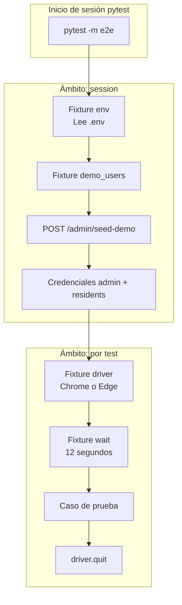

# INFORME DE PRUEBAS AUTOMATIZADAS E2E (SELENIUM)

**Proyecto:** Residencial — Tu hogar, en orden  
**Módulo evaluado:** Frontend web (React + Vite)  
**Herramientas:** pytest 8.4, Selenium 4.21, Python 3.10+  
**Ubicación del código:** `cobros-residenciales/frontend/e2e/`  
**Fecha de referencia:** Mayo 2026  

---

## 1. Resumen ejecutivo

El proyecto **Residencial** dispone de un conjunto reducido de **pruebas end-to-end (E2E)** que validan, mediante un navegador real controlado por **Selenium**, los flujos críticos de **autenticación** y acceso a los paneles de **administrador** y **residente**.

En la versión actual se ejecutan **tres (3) casos de prueba**, marcados con el etiquetado pytest `@pytest.mark.e2e`. Las pruebas dependen de que el **backend** y el **frontend** estén en ejecución, y preparan datos de demostración mediante el endpoint `POST /admin/seed-demo` antes de interactuar con la interfaz.

Este informe documenta el alcance de las pruebas, los requisitos, el procedimiento de ejecución, la arquitectura de fixtures, el detalle paso a paso de cada caso, los selectores utilizados, las dependencias, la resolución de incidencias frecuentes y las recomendaciones para ampliar la cobertura.

---

## 2. Alcance: qué se prueba

Se implementan **tres pruebas de humo (smoke tests)** en el archivo `tests/test_auth_and_dashboards.py`:

| N.º | Identificador del test | Objetivo |
|-----|------------------------|----------|
| 1 | `test_invalid_login_shows_error` | Verificar que credenciales incorrectas muestran un mensaje de error visible en pantalla de login. |
| 2 | `test_admin_can_login_and_logout` | Verificar que un administrador demo puede iniciar sesión, acceder al panel administrativo y cerrar sesión correctamente. |
| 3 | `test_resident_can_login` | Verificar que un residente demo puede iniciar sesión y visualizar su panel de residente. |

### 2.1 Qué queda fuera del alcance actual

Las siguientes funcionalidades **no** están cubiertas por las pruebas Selenium existentes:

- Pagos en línea (servicio Payments).
- Reservas de parqueadero o salón comunal.
- Suscripción y pago de gimnasio.
- Facturación electrónica (Factus / DIAN).
- Operaciones CRUD del panel administrador (usuarios, unidades, amenidades).
- Pruebas unitarias del frontend (Jest/Vitest) o del backend (pytest en API).

---

## 3. Requisitos del entorno

| Requisito | Especificación |
|-----------|----------------|
| **Sistema operativo** | Windows 10/11 (entorno de desarrollo documentado) |
| **Python** | 3.10 o superior |
| **Navegador** | Google Chrome o Microsoft Edge instalado localmente |
| **Docker Desktop** | Para levantar backend (`:8000`), payments (`:8002`), MongoDB y frontend (`:5174`) |
| **Variable de entorno del proyecto** | `APP_ENV=dev` en `.env` raíz (habilita `POST /admin/seed-demo`) |
| **Node.js** (opcional) | 18+ solo si se ejecuta el frontend con `npm run dev` en lugar de Docker |

### 3.1 Servicios que deben estar activos

| Servicio | URL local | Obligatorio para E2E |
|----------|-----------|----------------------|
| Backend API | http://localhost:8000 | Sí (seed-demo y autenticación) |
| Frontend | http://localhost:5174 (Docker) o :5173 (`npm run dev`) | Sí |
| Payments API | http://localhost:8002 | No (configurado pero no usado en los 3 tests) |

---

## 4. Manual de ejecución en cinco pasos

### Paso 1 — Levantar el stack con Docker Compose

```powershell
cd "c:\Users\ferna\OneDrive\Escritorio\tarea de diana\cobros-residenciales"
docker compose up -d
```

**Verificación:** http://localhost:8000/health debe responder `{"status":"ok"}`.

### Paso 2 — Crear entorno virtual e instalar dependencias

```powershell
cd frontend\e2e
python -m venv .venv
.\.venv\Scripts\activate
pip install -r requirements.txt
copy .env.example .env
```

### Paso 3 — Configurar variables en `frontend/e2e/.env`

Ejemplo recomendado con frontend en Docker:

```env
FRONTEND_URL=http://localhost:5174
BACKEND_URL=http://localhost:8000
PAYMENTS_URL=http://localhost:8002
BROWSER=chrome
HEADLESS=1
```

### Paso 4 — Confirmar que el frontend responde

Abrir en el navegador la URL definida en `FRONTEND_URL` (p. ej. http://localhost:5174/login).

### Paso 5 — Ejecutar la suite E2E

```powershell
cd frontend\e2e
.\.venv\Scripts\activate
pytest -m e2e
```

**Resultado esperado:** `3 passed`.

---

## 5. Comandos útiles

| Comando | Propósito |
|---------|-----------|
| `pytest -m e2e` | Ejecutar únicamente tests con marcador `e2e` |
| `pytest -m e2e -v` | Salida detallada (nombre de cada test) |
| `pytest -m e2e -x` | Detener en el primer fallo |
| `pytest -m e2e --tb=short` | Traceback abreviado ante errores |
| `pytest tests/test_auth_and_dashboards.py::test_resident_can_login -m e2e` | Ejecutar un solo caso |
| Configurar `HEADLESS=0` en `.env` | Mostrar ventana del navegador durante la prueba |

---

## 6. Arquitectura de las pruebas (fixtures y seed-demo)

### 6.1 Diagrama de flujo



### 6.2 Descripción de fixtures (`tests/conftest.py`)

| Fixture | Ámbito | Función |
|---------|--------|---------|
| `env` | session | Carga `FRONTEND_URL`, `BACKEND_URL`, `PAYMENTS_URL`, `BROWSER`, `HEADLESS` desde `.env`. |
| `demo_users` | session | Invoca `POST {BACKEND_URL}/admin/seed-demo`; expone `admin`, lista `residents` y alias `resident` (primer residente). |
| `driver` | function | Instancia WebDriver (Chrome por defecto o Edge), ventana 1440×900, timeout de carga 30 s; cierra al finalizar cada test. |
| `wait` | function | `WebDriverWait(driver, 12)` para esperas explícitas. |

### 6.3 Función auxiliar `login()`

Realiza la secuencia común de inicio de sesión:

1. Navegar a `{FRONTEND_URL}/login`
2. Completar `[data-testid='login-email']`
3. Completar `[data-testid='login-password']`
4. Clic en `[data-testid='login-submit']`

---

## 7. Detalle de cada prueba (paso a paso)

### 7.1 Test 1 — `test_invalid_login_shows_error`

| Paso | Acción | Criterio de éxito |
|------|--------|-------------------|
| 1 | Ejecutar `login()` con email `noexiste@example.com` y contraseña `badpass` | Formulario enviado |
| 2 | Esperar visibilidad de `[data-testid='login-error']` | Elemento presente en DOM |
| 3 | Assert `err.text.strip() != ""` | Mensaje de error no vacío |

**Propósito:** Validar retroalimentación al usuario ante autenticación fallida.

---

### 7.2 Test 2 — `test_admin_can_login_and_logout`

| Paso | Acción | Criterio de éxito |
|------|--------|-------------------|
| 1 | Login con `demo_users["admin"]["email"]` y contraseña del seed | Redirección al panel |
| 2 | Esperar `[data-testid='admin-dashboard-title']` | Panel administrativo cargado |
| 3 | Clic en `[data-testid='logout']` | Solicitud de cierre de sesión |
| 4 | Esperar `[data-testid='login-submit']` | Pantalla de login restaurada |

**Propósito:** Validar ciclo completo de sesión del rol administrador.

---

### 7.3 Test 3 — `test_resident_can_login`

| Paso | Acción | Criterio de éxito |
|------|--------|-------------------|
| 1 | Login con `demo_users["resident"]["email"]` y contraseña del seed | Redirección al panel |
| 2 | Esperar `[data-testid='resident-dashboard-title']` | Panel de residente cargado |

**Propósito:** Validar acceso del rol residente con datos sembrados por `seed-demo`.

**Nota:** El fixture asigna `resident` al **primer** elemento de la lista devuelta por el backend (`residente_demo@conjunto.com`).

---

## 8. Selectores `data-testid`

### 8.1 Utilizados en las pruebas actuales

| `data-testid` | Componente / pantalla |
|---------------|------------------------|
| `login-email` | Campo correo — LoginPage |
| `login-password` | Campo contraseña — LoginPage |
| `login-submit` | Botón iniciar sesión — LoginPage |
| `login-error` | Mensaje de error — LoginPage |
| `admin-dashboard-title` | Título panel — AdminDashboard |
| `resident-dashboard-title` | Título panel — ResidentDashboard |
| `logout` | Cerrar sesión — App TopBar |

### 8.2 Disponibles para ampliar cobertura (no usados aún)

| `data-testid` | Ubicación aproximada |
|---------------|----------------------|
| `nav-{sección}` | Sidebar — App.tsx |
| `theme-toggle` | Alternar tema claro/oscuro |
| `admin-seed-demo` | Botón crear demo — AdminDashboard |
| `admin-amenity-create` | Crear amenidad — AdminDashboard |
| `parking-amenity`, `parking-start`, `parking-end`, `parking-reserve` | Reserva parqueadero — ResidentDashboard |
| `hall-amenity`, `hall-date`, `hall-reserve` | Reserva salón — ResidentDashboard |
| `gym-subscribe` | Suscripción gimnasio — ResidentDashboard |

**Recomendación:** Toda nueva prueba E2E debe preferir selectores `data-testid` frente a XPath o clases CSS, por estabilidad ante cambios de diseño.

---

## 9. Dependencias del proyecto de pruebas

Archivo: `frontend/e2e/requirements.txt`

| Paquete | Versión | Rol en el informe |
|---------|---------|-------------------|
| **pytest** | 8.4.0 | Framework de ejecución y marcadores |
| **selenium** | 4.21.0 | Control del navegador (WebDriver) |
| **requests** | 2.32.3 | Cliente HTTP para `seed-demo` |
| **python-dotenv** | 1.0.1 | Carga de variables desde `.env` |

Configuración adicional en `pytest.ini`:

- `testpaths = tests`
- Marcador registrado: `e2e: end-to-end selenium tests`
- Opción por defecto: `-q` (salida silenciosa)

---

## 10. Problemas frecuentes y soluciones

| Incidencia | Causa probable | Solución |
|------------|----------------|----------|
| Error de conexión al llamar `seed-demo` | Backend no levantado | `docker compose up -d`; verificar `:8000/health` |
| HTTP 400 en `seed-demo` | `APP_ENV` distinto de `dev` | En `.env` raíz: `APP_ENV=dev` |
| Timeout esperando elementos de login | `FRONTEND_URL` incorrecta | Docker → `http://localhost:5174`; npm dev → `http://localhost:5173` |
| `SessionNotCreatedException` | Navegador o driver incompatible | Actualizar Chrome/Edge; probar `BROWSER=edge` |
| Tests OK pero no se ve el navegador | Modo headless activo | `HEADLESS=0` en `e2e/.env` |
| Página en blanco o 404 | Frontend detenido | Confirmar URL manualmente antes de pytest |

---

## 11. Credenciales de demostración

Generadas automáticamente por `POST /admin/seed-demo` (solo entorno desarrollo):

### 11.1 Usadas directamente por los tests

| Rol | Correo electrónico | Contraseña |
|-----|-------------------|------------|
| Administrador | `admin_demo@conjunto.com` | `Admin12345!` |
| Residente (primer residente de la lista) | `residente_demo@conjunto.com` | `Residente123!` |

### 11.2 Otros residentes del seed (no referenciados en los 3 tests)

| Nombre | Correo | Contraseña | Unidad |
|--------|--------|------------|--------|
| Ana Gómez | `ana@conjunto.com` | `Residente123!` | APT-102 |
| Carlos Ramírez | `carlos@conjunto.com` | `Residente123!` | APT-103 |
| Laura Martínez | `laura@conjunto.com` | `Residente123!` | APT-201 |
| David Rodríguez | `david@conjunto.com` | `Residente123!` | APT-202 |

---

## 12. Cómo agregar más pruebas

### 12.1 Procedimiento recomendado

1. Añadir atributo `data-testid` en el componente React objetivo.
2. Crear o extender archivo en `frontend/e2e/tests/` (p. ej. `test_reservations.py`).
3. Declarar `pytestmark = pytest.mark.e2e` o decorador `@pytest.mark.e2e` por función.
4. Reutilizar fixtures `env`, `driver`, `wait`, `demo_users`.
5. Ejecutar `pytest -m e2e` y validar en CI o local con `HEADLESS=1`.

### 12.2 Plantilla de ejemplo

```python
import pytest
from selenium.webdriver.common.by import By
from selenium.webdriver.support import expected_conditions as EC
from test_auth_and_dashboards import login

pytestmark = pytest.mark.e2e

def test_resident_navigates_to_gym(env, demo_users, driver, wait):
    r = demo_users["resident"]
    login(driver, wait, env.frontend_url, r["email"], r["password"])
    wait.until(EC.element_to_be_clickable((By.CSS_SELECTOR, "[data-testid='nav-gimnasio']"))).click()
    wait.until(EC.visibility_of_element_located((By.CSS_SELECTOR, "[data-testid='gym-subscribe']")))
```

### 12.3 Prioridades sugeridas para ampliación

1. Flujo de pago mock de una factura pendiente.
2. Creación de reserva de parqueadero y visualización de PIN.
3. Botón «Crear demo» visible solo para admin en dev.
4. Navegación entre secciones del sidebar (admin y residente).

---

## 13. Estructura de carpetas

```
cobros-residenciales/
├── INFORME_PRUEBAS_SELENIUM.md    ← Este informe
├── PRUEBAS_SELENIUM.md            ← Manual operativo complementario
└── frontend/
    └── e2e/
        ├── .env.example           # Plantilla FRONTEND_URL, BACKEND_URL, etc.
        ├── .env                   # Configuración local (no versionar secretos)
        ├── pytest.ini             # Marcador e2e y testpaths
        ├── requirements.txt       # Dependencias Python
        ├── README.md              # Resumen breve
        └── tests/
            ├── conftest.py        # Fixtures: env, demo_users, driver, wait
            └── test_auth_and_dashboards.py   # 3 casos de prueba
```

---

## 14. Conclusiones

1. El proyecto cuenta con **automatización E2E básica pero funcional** orientada a **autenticación y acceso por rol**, adecuada como línea base de calidad antes de despliegues o entregas académicas.

2. La preparación de datos mediante **`seed-demo`** desacopla los tests de una carga manual previa de usuarios y unidades, siempre que el entorno sea de desarrollo.

3. La cobertura actual es **limitada** frente al tamaño funcional del sistema (pagos, reservas, Factus, administración). Se recomienda extender la suite usando los `data-testid` ya presentes en formularios de residente.

4. La ejecución está **documentada y reproducible** en cinco pasos, con variables centralizadas en `frontend/e2e/.env` y marcador pytest `e2e` para aislar estas pruebas del resto de posibles tests futuros.

---

## 15. Referencias internas

| Documento | Contenido relacionado |
|-----------|----------------------|
| `PRUEBAS_SELENIUM.md` | Manual rápido operativo |
| `frontend/e2e/README.md` | Instrucciones mínimas originales |
| `DOCUMENTACION.md` | Arquitectura general del sistema |
| `GUIA_EXPOSICION.md` | Demo funcional admin/residente |

---

**Elaborado para:** Proyecto Residencial — Tu hogar, en orden  
**Tipo de documento:** Informe técnico de pruebas automatizadas E2E  
