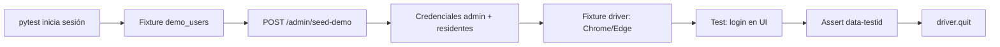

# Pruebas E2E con Selenium — Residencial

Manual rápido para ejecutar y entender las pruebas automáticas del frontend con **pytest + Selenium**.

**Ubicación del código:** `frontend/e2e/`

---

## 1. ¿Qué se prueba?

Son **smoke tests** (pruebas de humo): abren un navegador real, interactúan con la UI y validan flujos mínimos de login.

| # | Test | Archivo | Qué valida |
|---|------|---------|------------|
| 1 | `test_invalid_login_shows_error` | `tests/test_auth_and_dashboards.py` | Login con credenciales falsas → aparece mensaje de error |
| 2 | `test_admin_can_login_and_logout` | idem | Admin entra, ve el panel, cierra sesión y vuelve al login |
| 3 | `test_resident_can_login` | idem | Residente entra y ve su panel |

**No cubren (aún):** pagos, reservas, Factus, CRUD admin. Solo autenticación y carga de dashboards.

---

## 2. Requisitos

| Requisito | Versión / nota |
|-----------|----------------|
| **Python** | 3.10 o superior |
| **Chrome** o **Edge** | Instalado en Windows (Selenium 4 usa el driver automático) |
| **Docker** | Stack levantado: backend `:8000`, payments `:8002` |
| **Frontend** | Accesible en la URL que configures (ver abajo) |
| **Node** (opcional) | Solo si corres Vite con `npm run dev` fuera de Docker |

El backend debe estar en **`APP_ENV=dev`** para que `POST /admin/seed-demo` funcione (fixture de tests).

---

## 3. Manual rápido — ejecutar en 5 pasos

### Paso 1 — Levantar servicios

```powershell
cd "c:\Users\ferna\OneDrive\Escritorio\tarea de diana\cobros-residenciales"
docker compose up -d
```

Comprueba:

- http://localhost:8000/health → `{"status":"ok"}`
- http://localhost:5174 → frontend (Docker)

### Paso 2 — Entorno Python E2E

```powershell
cd frontend\e2e
python -m venv .venv
.\.venv\Scripts\activate
pip install -r requirements.txt
copy .env.example .env
```

### Paso 3 — Configurar `.env`

Edita `frontend/e2e/.env`:

```env
# Si usas Docker para el frontend (puerto 5174):
FRONTEND_URL=http://localhost:5174

# Si usas npm run dev en el host (puerto 5173):
# FRONTEND_URL=http://localhost:5173

BACKEND_URL=http://localhost:8000
PAYMENTS_URL=http://localhost:8002

BROWSER=chrome
HEADLESS=1
```

| Variable | Uso |
|----------|-----|
| `FRONTEND_URL` | URL base del React (sin `/login` al final) |
| `BACKEND_URL` | API para `seed-demo` antes de los tests |
| `PAYMENTS_URL` | Configurada; los 3 tests actuales no la usan |
| `BROWSER` | `chrome` (default) o `edge` |
| `HEADLESS` | `1` = sin ventana · `0` = ver el navegador |

### Paso 4 — Correr tests

Con el frontend ya visible en `FRONTEND_URL`:

```powershell
cd frontend\e2e
.\.venv\Scripts\activate
pytest -m e2e
```

Salida esperada (ejemplo):

```text
...                                                                    [100%]
3 passed
```

### Paso 5 — Ver el navegador (opcional)

En `.env` pon `HEADLESS=0` y vuelve a ejecutar:

```powershell
pytest -m e2e -v
```

---

## 4. Comandos útiles

| Comando | Descripción |
|---------|-------------|
| `pytest -m e2e` | Solo tests E2E (marcador `e2e`) |
| `pytest -m e2e -v` | Modo verbose (nombre de cada test) |
| `pytest tests/test_auth_and_dashboards.py::test_resident_can_login -m e2e` | Un solo test |
| `pytest -m e2e --tb=short` | Traceback corto si falla |
| `pytest -m e2e -x` | Parar en el primer fallo |

---

## 5. Cómo funcionan los tests (por dentro)



### Fixture `demo_users` (sesión)

Antes de los tests, una sola vez:

```http
POST http://localhost:8000/admin/seed-demo
```

Devuelve credenciales; el test usa:

- `demo_users["admin"]` → email y password del admin demo
- `demo_users["resident"]` → primer residente de la lista (`residente_demo@conjunto.com`)

### Fixture `driver`

Abre el navegador (1440×900), timeout de carga 30 s, lo cierra al terminar cada test.

### Fixture `wait`

`WebDriverWait` de **12 segundos** para esperar elementos visibles.

### Helper `login()`

1. `GET {FRONTEND_URL}/login`
2. Rellenar `[data-testid='login-email']`
3. Rellenar `[data-testid='login-password']`
4. Clic en `[data-testid='login-submit']`

---

## 6. Detalle de cada prueba

### Test 1 — Login inválido

```
test_invalid_login_shows_error
```

| Paso | Acción |
|------|--------|
| 1 | Login con `noexiste@example.com` / `badpass` |
| 2 | Espera elemento `[data-testid='login-error']` visible |
| 3 | Assert: el texto del error no está vacío |

### Test 2 — Admin login y logout

```
test_admin_can_login_and_logout
```

| Paso | Acción |
|------|--------|
| 1 | Login con credenciales de `demo_users["admin"]` |
| 2 | Espera `[data-testid='admin-dashboard-title']` |
| 3 | Clic `[data-testid='logout']` |
| 4 | Espera `[data-testid='login-submit']` (volvió al login) |

### Test 3 — Residente login

```
test_resident_can_login
```

| Paso | Acción |
|------|--------|
| 1 | Login con `demo_users["resident"]` |
| 2 | Espera `[data-testid='resident-dashboard-title']` |

---

## 7. Selectores `data-testid` usados

| testid | Pantalla |
|--------|----------|
| `login-email` | Login |
| `login-password` | Login |
| `login-submit` | Login |
| `login-error` | Login (error) |
| `admin-dashboard-title` | Panel admin |
| `resident-dashboard-title` | Panel residente |
| `logout` | Topbar (ambos roles) |

**Disponibles en la app pero no usados aún en tests:**

`nav-*`, `theme-toggle`, `admin-seed-demo`, `admin-amenity-create`, `parking-*`, `hall-*`, `gym-subscribe`.

---

## 8. Dependencias (`requirements.txt`)

| Paquete | Versión | Rol |
|---------|---------|-----|
| pytest | 8.4.0 | Runner de tests |
| selenium | 4.21.0 | Automatización del navegador |
| requests | 2.32.3 | Llamada HTTP a `seed-demo` |
| python-dotenv | 1.0.1 | Carga `.env` |

Configuración pytest: `frontend/e2e/pytest.ini` → marcador `e2e`, carpeta `tests/`.

---

## 9. Problemas frecuentes

| Síntoma | Solución |
|---------|----------|
| `Connection refused` en seed-demo | Levanta Docker: `docker compose up -d` |
| `seed-demo` 400 | Revisa `APP_ENV=dev` en `.env` del proyecto |
| Timeout en login | `FRONTEND_URL` incorrecta: usa **5174** con Docker, **5173** con `npm run dev` |
| `SessionNotCreatedException` | Actualiza Chrome/Edge o prueba `BROWSER=edge` |
| Tests pasan pero no ves UI | Pon `HEADLESS=0` |
| Frontend no carga | Abre manualmente la URL de `FRONTEND_URL` antes de pytest |

---

## 10. Credenciales que usan los tests

Generadas por `seed-demo` (misma contraseña para todos los residentes):

| Rol | Email | Contraseña |
|-----|-------|------------|
| Admin (tests) | `admin_demo@conjunto.com` | `Admin12345!` |
| Residente (tests usa el 1.º) | `residente_demo@conjunto.com` | `Residente123!` |

---

## 11. Ampliar las pruebas (idea)

Para un nuevo test E2E:

1. Añade `data-testid` en el componente React.
2. Crea función en `tests/test_*.py` con `pytestmark = pytest.mark.e2e`.
3. Usa fixtures `env`, `driver`, `wait`, `demo_users`.
4. Ejecuta `pytest -m e2e`.

Ejemplo de esqueleto:

```python
@pytest.mark.e2e
def test_admin_seed_demo_button(env, demo_users, driver, wait):
    login(driver, wait, env.frontend_url, demo_users["admin"]["email"], demo_users["admin"]["password"])
    wait.until(EC.element_to_be_clickable((By.CSS_SELECTOR, "[data-testid='admin-seed-demo']")))
```

---

## 12. Estructura de carpetas

```
frontend/e2e/
├── .env.example          # Plantilla de variables
├── .env                  # Tu config (no commitear si tiene secretos)
├── pytest.ini            # Marcador e2e
├── requirements.txt      # Dependencias Python
├── README.md             # Resumen corto
└── tests/
    ├── conftest.py       # Fixtures: env, driver, demo_users
    └── test_auth_and_dashboards.py   # 3 tests
```

---

## 13. Resumen de una línea

> Con Docker arriba, venv en `frontend/e2e`, `.env` con `FRONTEND_URL=http://localhost:5174`, ejecuta `pytest -m e2e` → 3 pruebas Selenium de login admin, residente y error de credenciales.

---

*Proyecto: **Residencial — Tu hogar, en orden***
